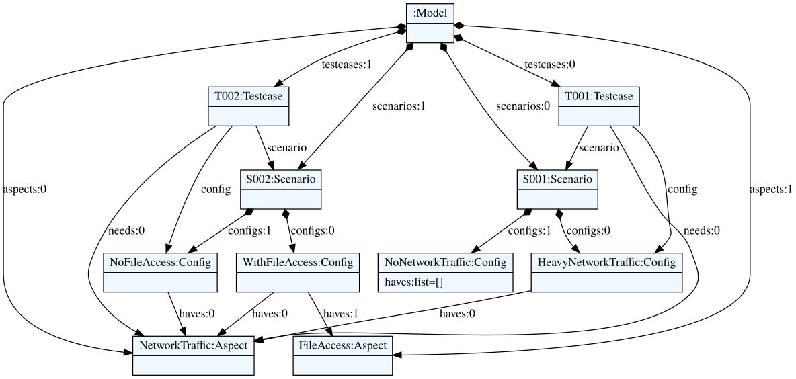

# TextX Intro

TextX is a Python library to allow an easy creation of
DSL validators and artifact generators:

  * Reading model files (grammar based parsing, reference resolution and post processing).
  * Validating the model.
  * Generating output artifacts (e.g., code).
  
A fundamental difference to Xtext is that the
meta model classes (describing the model elements)
are dynamically generated instead of generating code
from them. Thus, a grammar in TextX in interpreted dynamically 
and not compiled.

TextX has only few dependencies and very compact 
projects can be created. Details see
[(Dejanović et al. 2017)](references.md#dejanovic2017)
and the [TextX project page](references.md#textx).

Normally, a similar modularization as for Xtext projects 
is employed to separate different responsibilities across
software modules (e.g. modules for the 
grammar, validation, and code generation). 
However, it is possible to put an entire project
including grammar and the validation into one file:
the following code illustrates a meta model with an example model
which is validated (similar to the example in the 
[introductory example of validation](basics.md#validation)).

::uml:: format="svg" classes="uml MetaModelExample" alt="Meta Model Example"
class Aspect {
  name
}
class Scenario {
  name
}
class Config {
  name
}
class Testcase {
 name
}
Scenario *- "n" Config
Testcase o-- "1" Scenario
Testcase o-- "1" Config
Config o-- "n" Aspect: haves
Testcase o-- "n" Aspect: needs
::end-uml::

    :::python
    from textx import metamodel_from_str
    from textx.scoping.providers import RelativeName, FQN
    from textx.export import model_export
    # ------------------------------------
    # GRAMMAR
    #
    meta_model = metamodel_from_str('''
        Model: aspects+=Aspect scenarios+=Scenario testcases+=Testcase;
        Scenario: 'SCENARIO' name=ID 'BEGIN' 
            configs+=Config
        'END';
        Config: 'CONFIG' name=ID 'HAS' '(' haves*=[Aspect] ')';
        Aspect: 'ASPECT' name=ID;
        Testcase: 'TESTCASE' name=ID 'BEGIN'
            'USES' scenario=[Scenario] 'WITH' config=[Config]
            'NEEDS' '(' needs*=[Aspect] ')'
        'END';
        Comment: /\/\/.*/;
    ''')
    
    # ------------------------------------
    # SCOPING
    #
    meta_model.register_scope_providers({
        '*.*': FQN(),
        'Testcase.config': RelativeName('scenario.configs')
    })
    
    # ------------------------------------
    # VALIDATION
    #
    def check_testcase(testcase):
        """
        checks that the config used by the testcase fulfills its needs
        """
        for need in testcase.needs:
            if need not in testcase.config.haves:
                raise Exception("{}: {} not found in {}.{}".format(
                        testcase.name,
                        need.name, 
                        testcase.scenario.name,
                        testcase.config.name
                        ))
    
    meta_model.register_obj_processors({
            'Testcase': check_testcase
    })
    
    # ------------------------------------
    # EXAMPLE
    #
    model = meta_model.model_from_str('''
        ASPECT NetworkTraffic
        ASPECT FileAccess
        SCENARIO S001 BEGIN
            CONFIG HeavyNetworkTraffic HAS (NetworkTraffic)
            CONFIG NoNetworkTraffic HAS ()
        END
        SCENARIO S002 BEGIN
            CONFIG WithFileAccess HAS (NetworkTraffic FileAccess)
            CONFIG NoFileAccess HAS (NetworkTraffic)
        END
        TESTCASE T001 BEGIN
            USES S001 WITH HeavyNetworkTraffic
            NEEDS (NetworkTraffic)
        END
        TESTCASE T002 BEGIN
            //USES S001 WITH NoNetworkTraffic // Error
            USES S002 WITH NoFileAccess
            NEEDS (NetworkTraffic)
        END
    ''')
    
    model_export(model, 'model.dot')

