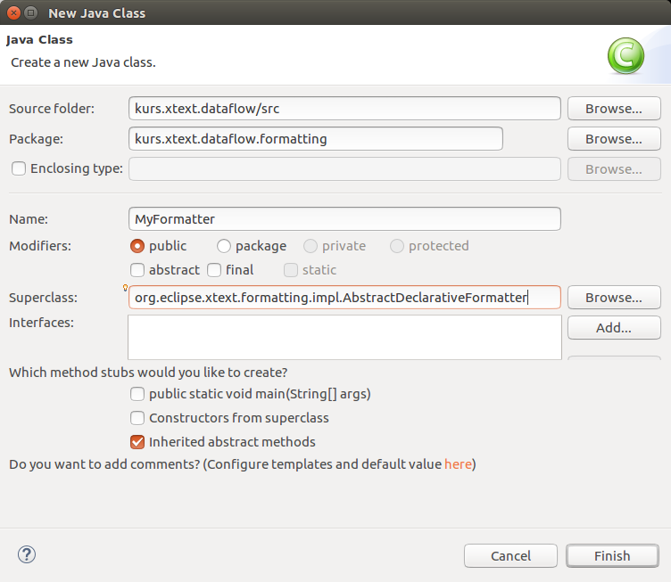

# Auto Formatting

When you change the model (e.g. using the 
[tree editor](xtext_a_first_grammar.md#Editor))
and you save your changes, you will notice that the
model text is updated, but does not contain any line breaks.
Also, when invooking the auto-formatter of Eclipse 
(CTRL-SHIFT-F in the text editor of Eclipse), the same
effect occurs. This behavior can be controlled in Xtext
with a special Xtext Formatter.

## Xtext Formatter 

Create a new class "kurs.xtext.dataflow.formatting.MyFormatter"
in your Xtext project, which inherits from
"org.eclipse.xtext.formatting.impl.AbstractDeclarativeFormatter".

In this class you can control, e.g., the formatting
around '{' and '}'. More Information: e.g., 
[JavaDoc of FormattingConfig](http://download.eclipse.org/modeling/tmf/xtext/javadoc/2.3/org/eclipse/xtext/formatting/impl/FormattingConfig.html).

    :::java
    import org.eclipse.xtext.Keyword;
    import org.eclipse.xtext.formatting.impl.AbstractDeclarativeFormatter;
    import org.eclipse.xtext.formatting.impl.FormattingConfig;
    import org.eclipse.xtext.util.Pair;
    
    import kurs.xtext.dataflow.services.DataFlowDslGrammarAccess;
    
    public class MyFormatter extends AbstractDeclarativeFormatter {
    
        @Override
        protected void configureFormatting(FormattingConfig config) {
    
            DataFlowDslGrammarAccess ga = (DataFlowDslGrammarAccess) getGrammarAccess();
            
            for (Pair<Keyword, Keyword> pair : ga.findKeywordPairs("{", "}")) {
                config.setLinewrap().after(pair.getFirst());
                config.setIndentationIncrement().after(pair.getFirst());
                config.setLinewrap().before(pair.getSecond());
                config.setIndentationDecrement().before(pair.getSecond());
                config.setLinewrap().after(pair.getSecond());
            }		
            config.setLinewrap(1, 1, 1).after(ga.getKInstanceRule());		
        }
    
    }

This new formatter must be registered for your meta model:
edit the *RuntimeModule"-file
"kurs.xtext.dataflow.DataFlowDslRuntimeModule.xtend" 
and add the following code:

    :::xtend
	override bindIFormatter() {
		MyFormatter
	}
	
(Note: Xtend is a language which translates to Java.
Thus, every Xtend class can also be written in Java.)

Restart your Eclipse Runtime Workbench and test the new 
formatter (CTRL-SHIFT-F).

