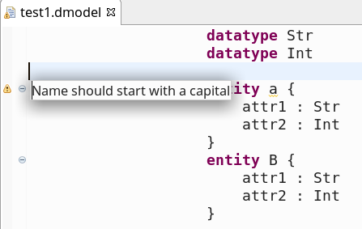

# Model ::namedref::{xtext_validation:Validation}

A model can be validated according certain validation rules.
These rules have to be define by the meta modeller
in the meta model. Error and warning messages can be reported
and attached to model elements or text location. These
messages are displayed in the Eclipse model text editor.
More Information, see ::namedref::(references.md#mooji2017a).

::namedref::(references.md#rentzReichert2017)
suggested to put as little as possible semantics into
the grammar (e.g. "+" instead of "*") and to add this 
semantics to the validation code. This often allows
to generate more meaningful domain errors.

A good introduction can be found here:
::namedref::(references.md#xtext15minext), in the section 
"Creating Custom Validation Rules".

## Validation Example

Open the *Validator.xtend" file (automatically generated for
a new project), e.g., 
"kurs.xtext.dataflow.validation.DataFlowDslValidator.xtend".
Activate the commented code and modify it:

    ::xtend
    package kurs.xtext.dataflow.validation
    
    import org.eclipse.xtext.validation.Check
    import kurs.xtext.dataflow.dataFlowDsl.KComponent
    import kurs.xtext.dataflow.dataFlowDsl.DataFlowDslPackage
    
    class DataFlowDslValidator extends AbstractDataFlowDslValidator {
        
        public static val INVALID_NAME = 'invalidName'
    
        @Check
        def checkGreetingStartsWithCapital(Entity obj) {
            if (!Character.isUpperCase(obj.name.charAt(0))) {
                warning('Name should start with a capital', 
                        DomainmodelPackage.Literals.TYPE__NAME,
                        INVALID_NAME)
            }
        }

    }

Try your validator for your language in the Eclipse Runtime model editor.

Notes:

   * A validation rule is marked as such with the annotation "@Check". 
     The argument is a model element of the type to be checked.
   * The rule is checked during typing in the editor 
     (@Check allows to control if a rule is checked during 
     typing, when saving, or upon explicit request
     (see: org.eclipse.xtext.validation.CheckType; 
     press "F3" when having the cursor on @Check)
   * The rule above checks elements of type "Entity". 
     Errors/warning, if present, are attached to this model element.
   * A rule can generate "errors", "warnings" und "infos".
     The ID (in our case "INVALID_NAME") allows a rule to 
     be identified later, e.g., when
     implementing HotFixes for specific validation violations.
   * Why did we use "TYPE_NAME" instead of ENTITY_NAME? (Hint: ENTITY_NAME does
     not exist; How are Type and Entity related to each other?)
 